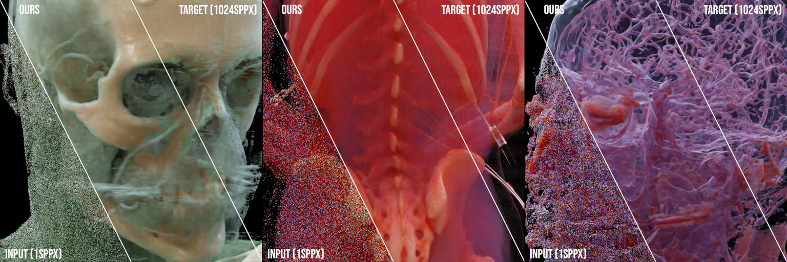

# Neural Denoising for Path Tracing of Medical Volumetric Data

Auxiliary source material for our HPG'20 paper "Neural Denoising for Path Tracing of Medical Volumetric Data": https://dl.acm.org/doi/abs/10.1145/3406181

## Overview

We transfer machine learning techniques previously applied to denoising surface-only Monte
Carlo renderings to path-traced visualizations of medical volumetric data. In the domain of medical imaging,
path-traced videos turned out to be an efficient means to visualize and understand internal structures, in
particular for less experienced viewers such as students or patients. However, the computational demands for
the rendering of high-quality path-traced videos are very high due to the large number of samples necessary for
each pixel. To accelerate the process, we present a learning-based technique for denoising path-traced videos
of volumetric data by increasing the sample count per pixel; both through spatial (integrating neighboring
samples) and temporal filtering (reusing samples over time). Our approach uses a set of additional features and
a loss function both specifically designed for the volumetric case. Furthermore, we present a novel network
architecture tailored for our purpose, and introduce reprojection of samples to improve temporal stability
and reuse samples over frames. As a result, we achieve good image quality even from severely undersampled
input images.

## Setup

Setup a virtual python environment:

    virtualenv -p python3 env
    source env/bin/activate
    pip3 install -r requirements.txt
 
## Train

Single autoencoder architecture:

    python src/train.py /path/to/data/noisy /path/to/data/clean /path/to/data/validation/noisy /path/to/data/validation/clean
    
Dual autoencoder architecture:

    python src/train.py /path/to/data/noisy /path/to/data/clean /path/to/data/validation/noisy /path/to/data/validation/clean -t dual
    
GAN-based dual autoencoder architecture:

    python src/train_relgan.py /path/to/data/noisy /path/to/data/clean /path/to/data/validation/noisy /path/to/data/validation/clean --big
    
Dual autoencoder architecture with temporal reprojection:

    python src/train_reproj.py /path/to/data/noisy /path/to/data/clean /path/to/data/validation/noisy /path/to/data/validation/clean --feature_select

Additional command line arguments are listed in the beginning of each source file.
  
## Denoise

    python src/denoise.py /path/to/model.pt /path/to/data/noisy /path/to/data/clean
  
Additional command line arguments are listed in the beginning of the source file.
  
## Pretrained Models

Pretrained models for all configurations are available at models/*.pt. To load a model into pytorch or access the weights:

    cd src/
    python3
    >>> import torch
    >>> import models
    >>> torch.load('../models/single_color_only.pt').state_dict()
  
## Data Layout

For each stored frame under /path/to/data/noisy the following data is expected:
  - \<Frame\>.hdr: input color data
  - \<Frame\>_pos.hdr: primary scatter positions
  - \<Frame\>_norm1.hdr: primary normals
  - \<Frame\>_norm2.hdr: color after first surface approximation
  - \<Frame\>_alb1.hdr: primary albedo
  - \<Frame\>_alb2.hdr: secondary albedo
  - \<Frame\>_vol1.hdr: primary volumetrics
  - \<Frame\>_vol2.hdr: secondary volumetrics
  
For each stored frame under /path/to/data/clean the following data is expected:
  - \<Frame\>.hdr: target color data
  
  
For temporal reprojection, each noisy frame is additionally expected to provide:
  - \<Frame\>_pos.dat: binary high-precision primary scatter positions
  - \<Frame\>_matrices.txt: three 4x4 floating point matrices (model, view, proj), i.e. 12 rows with 4 IEE plaintext floats each

File names are recursively globbed and then sorted alphanumerically, thus file names do not need to match exactly between noisy and clean data, just required to sort into the same order.

## Dataset

Unfortunately, due to their medical nature and data protection laws, it is not possible for us to publish the training datasets. We plan to extend this repository by a freely available dataset.
